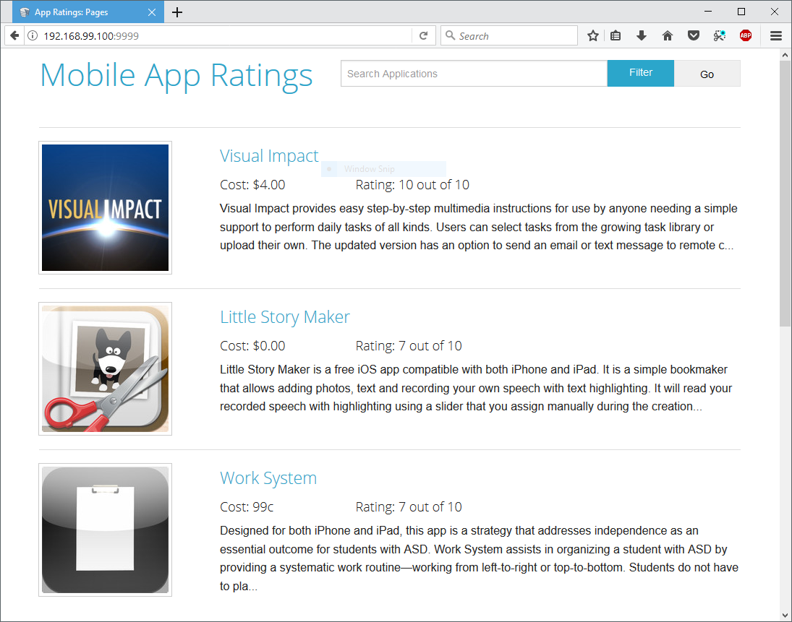
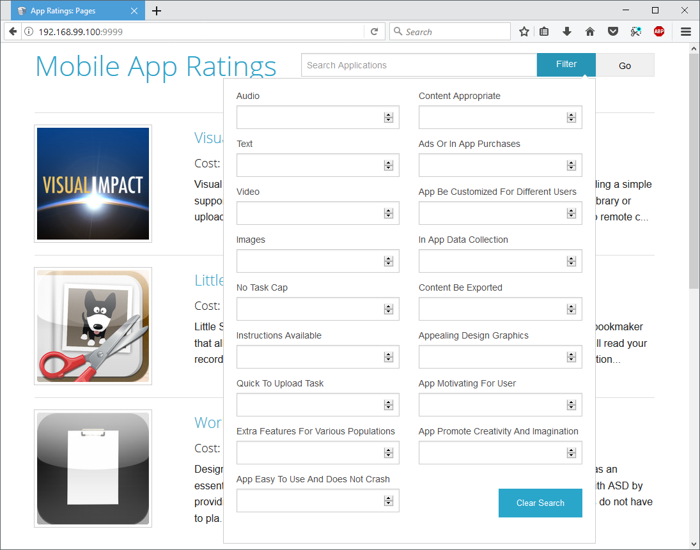
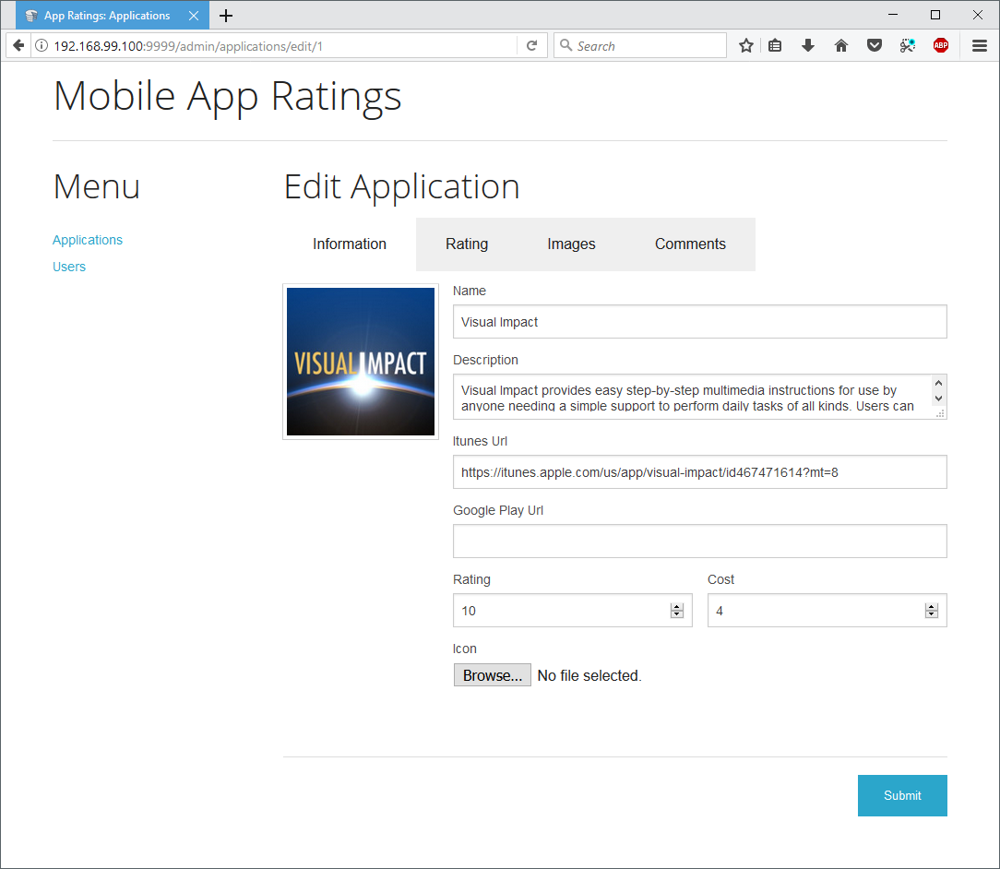

# App Ratings Site

Prototype for an app rating site that never got used :( Built with CakePHP 2.x, it still
runs well and is usable.

## Responsive
Uses foundation css for the layout.

## Filter

Filter the apps with a lot of different options.

## Editing

Builtin authentication for editing.

